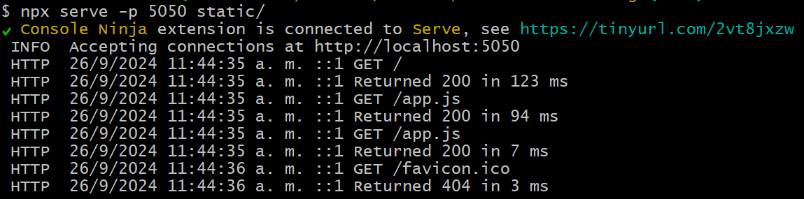
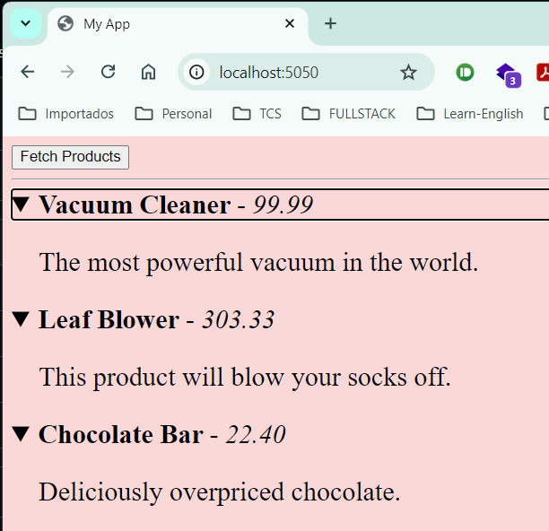

# lfw111x

Códigos del curso: Introduction to Node.js (LFW111) Ofrecido gratuitamente por The Linux Foundation.

## The purpose of course

From service-mocking, rapid-prototyping and real-time applications to Command Line Interfaces, and ecosystem utilities. This course provides a gentle introduction to Node.js, which is a JavaScript runtime. It will allow you to discover ways it can help you in everyday computing scenarios.

# From now...

I'll follow the course and push the changes of codes step by step.

## 03. Service Mocking

By the end of this chapter, you should be able to:

- Create a local file server with minimal effort.
- Create a very basic mock service with just Node.js core.
- Discuss how to rapidly scaffold a Fastify service for more involved mock services.

### Quick File Server (Summary)
In this section, we installed the serve package and created a static folder to store our web application files. We placed an index.html file and an app.js file in the static folder, which contain the necessary HTML and JavaScript code for our simple web application.

By running the serve command with the appropriate options, we started a file server that hosts our static folder on port 5050. This allows us to access our web application in the browser by visiting http://localhost:5050.

`npx serve -p 5050 static/` output in console and after visiting http://localhost:5050 in the browser:

